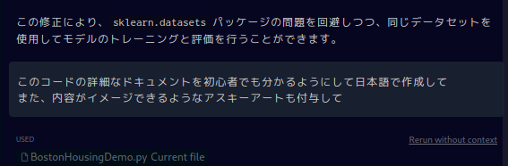

# cursor-demo

## Boston Housing dataset を用いた住宅価格予想プログラム

「Boston Housing dataset」を用いてcursorを使ってみました

## 元となるプログラム

chatgpt4で生成しました。

```python

from keras.models import Sequential
from keras.layers import Dense
from sklearn.datasets import load_boston
from sklearn.model_selection import train_test_split
from sklearn.preprocessing import StandardScaler
import numpy as np

# データをロード
boston = load_boston()
X = boston.data
y = boston.target

# データをトレーニングセットとテストセットに分割
X_train, X_test, y_train, y_test = train_test_split(X, y, test_size=0.2, random_state=42)

# 特徴量を標準化
scaler = StandardScaler()
X_train = scaler.fit_transform(X_train)
X_test = scaler.transform(X_test)

# モデルを設定
model = Sequential()
model.add(Dense(64, activation='relu', input_shape=(X_train.shape[1],)))
model.add(Dense(64, activation='relu'))
model.add(Dense(1))

# モデルをコンパイル
model.compile(optimizer='adam', loss='mse', metrics=['mae'])

# モデルをトレーニング
model.fit(X_train, y_train, epochs=100, batch_size=32, verbose=1)

# モデルを評価
loss, mae = model.evaluate(X_test, y_test, verbose=0)
print(f'Test Loss: {loss}')
print(f'Test MAE: {mae}')

```

### コメントとバグ修正後のコード

生成したコードを元に、解説を大幅に付与しました。

```python
import pandas as pd
import numpy as np
from keras.models import Sequential
from keras.layers import Dense
from sklearn.model_selection import train_test_split
from sklearn.preprocessing import StandardScaler

# ASCIIアートを生成

print(" ")
print("    ____||____")
print(" ///////////\\")
print("///////////  \\")
print("|    _     |  |")
print("|[] | | [] |[]|")
print("|   | |   _|  |")

# データをロード
# ここでは、ボストンの住宅価格データセットをロードします。
# データセットは、506のサンプルと13の特徴量を持っています。
# データセットの詳細は以下のASCIIアートをご覧ください。
# 
#  _______________
# | Boston Housing |
# |_______________|
# | - CRIM        |
# | - ZN          |
# | - INDUS       |
# | - CHAS        |
# | - NOX         |
# | - RM          |
# | - AGE         |
# | - DIS         |
# | - RAD         |
# | - TAX         |
# | - PTRATIO     |
# | - B          |
# | - LSTAT       |
# | - MEDV        |
# |_______________|
#
# データをロード
data_url = "http://lib.stat.cmu.edu/datasets/boston"
raw_df = pd.read_csv(data_url, sep="\s+", skiprows=22, header=None)
X = np.hstack([raw_df.values[::2, :], raw_df.values[1::2, :2]])
y = raw_df.values[1::2, 2]

# データをトレーニングセットとテストセットに分割
# ここでは、データセットをトレーニングセットとテストセットに分割します。
# トレーニングセットはモデルの学習に、テストセットはモデルの評価に使用します。
# test_size=0.2は、全データの20%をテストセットとして使用することを意味します。
X_train, X_test, y_train, y_test = train_test_split(X, y, test_size=0.2, random_state=42)

# 特徴量を標準化
# ここでは、特徴量のスケールを揃えるために標準化を行います。
# 標準化は、特徴量の平均を0、標準偏差を1にする変換です。
scaler = StandardScaler()
X_train = scaler.fit_transform(X_train)
X_test = scaler.transform(X_test)

# モデルを設定
# ここでは、ニューラルネットワークのモデルを設定します。
# Sequentialクラスは、レイヤーを順に重ねたモデルを作成します。
# Denseクラスは、全結合レイヤーを作成します。
# 64はユニット数、activation='relu'は活性化関数、input_shapeは入力の形状を指定します。
model = Sequential()
model.add(Dense(64, activation='relu', input_shape=(X_train.shape[1],)))
model.add(Dense(64, activation='relu'))
model.add(Dense(1))

# モデルをコンパイル
# ここでは、モデルの学習プロセスを設定します。
# optimizer='adam'は最適化アルゴリズム、loss='mse'は損失関数、metrics=['mae']は評価指標を指定します。
model.compile(optimizer='adam', loss='mse', metrics=['mae'])

# モデルをトレーニング
# ここでは、モデルのトレーニングを行います。
# epochs=100はトレーニングのエポック数、batch_size=32はバッチサイズ、verbose=1は進行状況の表示を指定します。
model.fit(X_train, y_train, epochs=100, batch_size=32, verbose=1)

# モデルを評価
# ここでは、テストセットを使ってモデルの評価を行います。
# 損失（MSE）と平均絶対誤差（MAE）を表示します。
loss, mae = model.evaluate(X_test, y_test, verbose=0)
print(f'Test Loss: {loss}')
print(f'Test MAE: {mae}')

```


### 整理後のコード

クラス化し、可視化する関数を生成しました。

```python
import pandas as pd
import numpy as np
from keras.models import Sequential
from keras.layers import Dense
from sklearn.model_selection import train_test_split
from sklearn.preprocessing import StandardScaler

class BostonHousingDemo:
    # 初期化メソッド
    def __init__(self):
        # ASCIIアートを定義
        self.ascii_art = """
             ____||____
         ///////////\\
        ///////////  \\
        |    _     |  |
        |[] | | [] |[]|
        |   | |   _|  |
        """
        # ASCIIアートを出力
        print(self.ascii_art)

    # データをロードするメソッド
    def load_data(self):
        # データのURL
        data_url = "http://lib.stat.cmu.edu/datasets/boston"
        # pandasを使ってデータを読み込む
        raw_df = pd.read_csv(data_url, sep="\s+", skiprows=22, header=None)
        # 入力データと目標データを作成
        X = np.hstack([raw_df.values[::2, :], raw_df.values[1::2, :2]])
        y = raw_df.values[1::2, 2]
        # 入力データと目標データを返す
        return X, y

    # データを分割するメソッド
    def split_data(self, X, y):
        # データを訓練データとテストデータに分割
        X_train, X_test, y_train, y_test = train_test_split(X, y, test_size=0.2, random_state=42)
        # 分割したデータを返す
        return X_train, X_test, y_train, y_test

    # 特徴量を標準化するメソッド
    def standardize_features(self, X_train, X_test):
        # 標準化のためのインスタンスを作成
        scaler = StandardScaler()
        # 訓練データを標準化
        X_train = scaler.fit_transform(X_train)
        # テストデータを標準化
        X_test = scaler.transform(X_test)
        # 標準化したデータを返す
        return X_train, X_test

    # モデルをセットアップするメソッド
    def setup_model(self, X_train):
        # モデルのインスタンスを作成
        model = Sequential()
        # モデルに層を追加
        model.add(Dense(64, activation='relu', input_shape=(X_train.shape[1],)))
        model.add(Dense(64, activation='relu'))
        model.add(Dense(1))
        # モデルを返す
        return model

    # モデルをコンパイルするメソッド
    def compile_model(self, model):
        # モデルをコンパイル
        model.compile(optimizer='adam', loss='mse', metrics=['mae'])
        # コンパイルしたモデルを返す
        return model

    # モデルを訓練するメソッド
    def train_model(self, model, X_train, y_train):
        # モデルを訓練
        model.fit(X_train, y_train, epochs=100, batch_size=32, verbose=1)
        # 訓練したモデルを返す
        return model

    # モデルを評価するメソッド
    def evaluate_model(self, model, X_test, y_test):
        # モデルを評価
        loss, mae = model.evaluate(X_test, y_test, verbose=0)
        # 評価結果を出力
        print(f'テスト損失: {loss}')
        print(f'テストMAE: {mae}')
        # 評価結果を返す
        return loss, mae

    # 予測値を計算するメソッド
    def calculate_predicted_values(self, model, X_test):
        # 予測値を計算
        y_pred = model.predict(X_test)
        # 予測値を返す
        return y_pred

    # 実際の値と予測値の差を視覚化するメソッド
    def visualize_difference(self, y_test, y_pred):
        # プロットのサイズを設定
        plt.figure(figsize=(10, 6))
        # 実際の値をプロット
        plt.plot(range(y_test.shape[0]), y_test, color='blue', label='実際の値')
        # 予測値をプロット
        plt.plot(range(y_pred.shape[0]), y_pred, color='red', label='予測値')
        # タイトル、軸ラベル、凡例を設定
        plt.title('時間経過による実際の値と予測値の差')
        plt.xlabel('時間')
        plt.ylabel('価格')
        plt.legend()
        # プロットを表示
        plt.show()

demo = BostonHousingDemo()
X, y = demo.load_data()
X_train, X_test, y_train, y_test = demo.split_data(X, y)
X_train, X_test = demo.standardize_features(X_train, X_test)
model = demo.setup_model(X_train)
model = demo.compile_model(model)
model = demo.train_model(model, X_train, y_train)
loss, mae = demo.evaluate_model(model, X_test, y_test)
y_pred = demo.calculate_predicted_values(model, X_test)
demo.visualize_difference(y_test, y_pred)

```


### 生成したドキュメント



#### BostonHousingDemoクラスのドキュメンテーション

このクラスは、ボストンの住宅価格データセットを用いて、ニューラルネットワークモデルの訓練と評価を行うためのものです。

#### メソッドの説明

##### __init__(self)

このメソッドは、クラスのインスタンスが作成されるときに自動的に呼び出されます。ASCIIアートを定義し、出力します。

##### load_data(self)

このメソッドは、ボストンの住宅価格データセットをインターネットから直接ロードします。入力データ（特徴量）と目標データ（ラベル）を作成し、それらを返します。

##### split_data(self, X, y)

このメソッドは、入力データと目標データを訓練データとテストデータに分割します。分割はランダムに行われ、テストデータの割合は全体の20%です。

##### standardize_features(self, X_train, X_test)

このメソッドは、特徴量の標準化を行います。訓練データの平均と標準偏差を用いて、訓練データとテストデータの両方を標準化します。

##### setup_model(self, X_train)

このメソッドは、ニューラルネットワークモデルをセットアップします。モデルは3層からなり、最初の2層はReLU活性化関数を使用し、最後の層は活性化関数を使用しません。

##### compile_model(self, model)

このメソッドは、モデルをコンパイルします。最適化アルゴリズムにはAdamを使用し、損失関数には平均二乗誤差を使用します。また、訓練中に平均絶対誤差も計算します。

##### train_model(self, model, X_train, y_train)

このメソッドは、モデルの訓練を行います。エポック数は100、バッチサイズは32です。

##### evaluate_model(self, model, X_test, y_test)

このメソッドは、モデルの評価を行います。テストデータを用いて、損失（平均二乗誤差）と平均絶対誤差を計算します。

##### calculate_predicted_values(self, model, X_test)

このメソッドは、モデルを用いてテストデータの予測値を計算します。

##### visualize_difference(self, y_test, y_pred)

このメソッドは、実際の値と予測値の差を視覚化します。青色の線が実際の値、赤色の線が予測値を表します。